## Ejercicios de Practica

### Ejercicio #1

Verificar si un string cumple con con las caracteristicas de una contraseña.

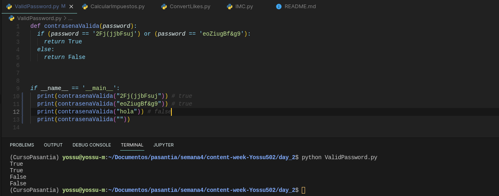

### Ejercicio #2

Programa que calcula los impuestos de una persona segun su edad e ingresos.

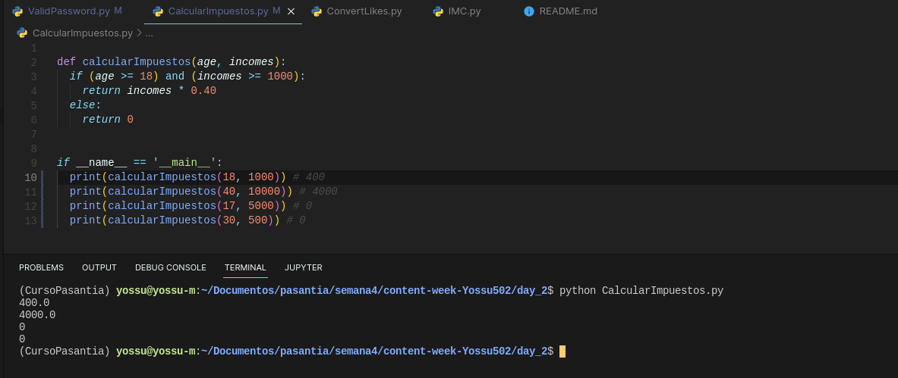

### Ejercicio #3

Programa que reciba un número y retorne un string utilizando el formato de K para miles y M para millones.

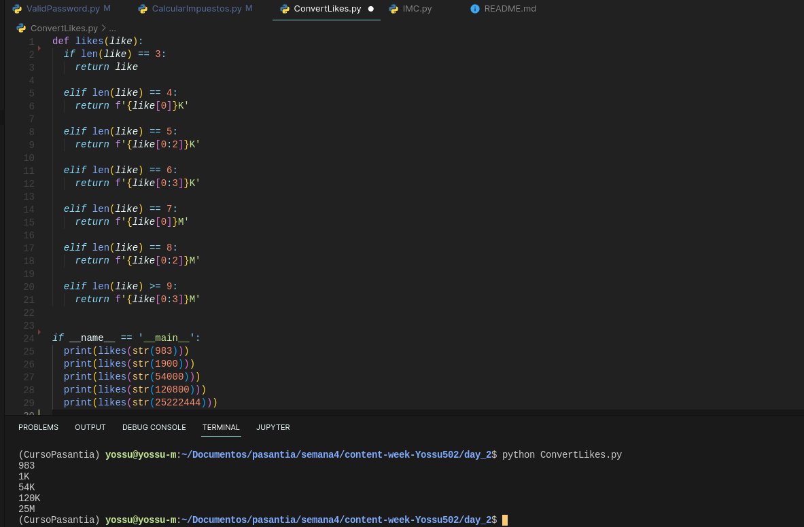

### Ejercicio #4

Programa que calcula el índice de masa corporal (IMC).

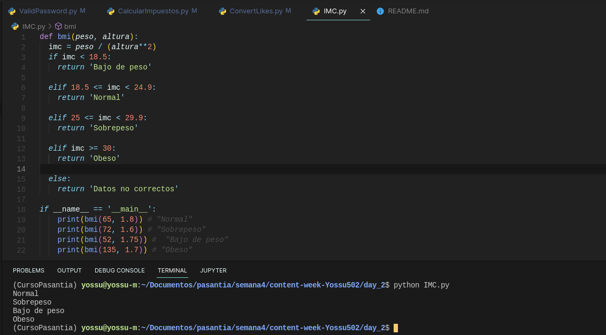

### Ejercicio de POO

Hacer un diagrama de clases para modelar un portafolio de obras de arte. Cada obra tiene un tipo (escultura, pintura, video,…), uno o más autores, una fecha de creación, un valor estimado. Adicionalmente cada obra tiene asociado un conjunto de fotografías y/o videos para exhibirla en el portafolio. A partir del portafolio se crean exposiciones de las obras en galerías. Cada exposición tiene unas fechas, un lugar y una descripción. Para una exposición se selecciona un conjunto de obras el portafolio que se van a presentar.

- Diagrama de clases
  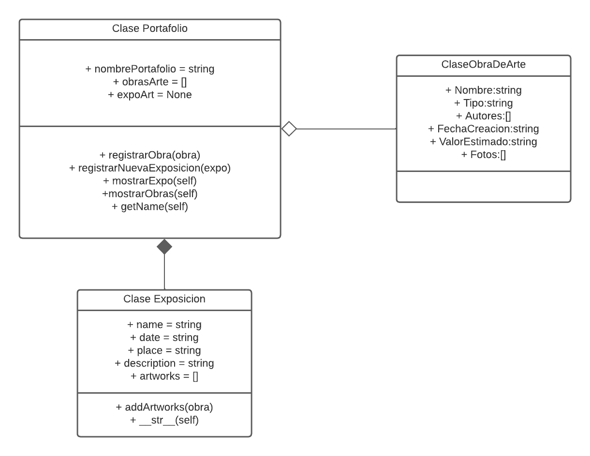

- Codigo de la implementacion en el lenguaje de python.
  
  1. Codigo de la clase de Obra de Arte.

  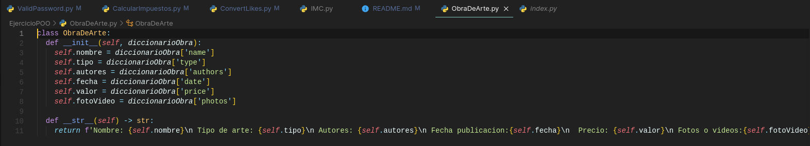

  2. Clase Exposicion

  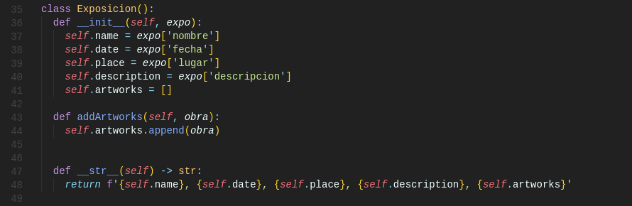

  3. Clase Portafolio, es la clase principal que ejecuta las demas.

  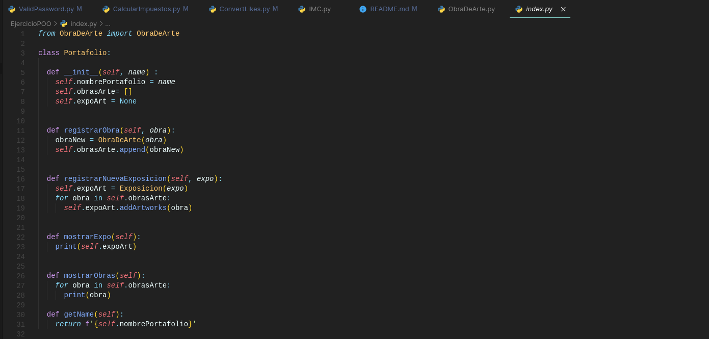

  4. Las pruebas de obras y exposicion que se enviaran son las siguientes:

  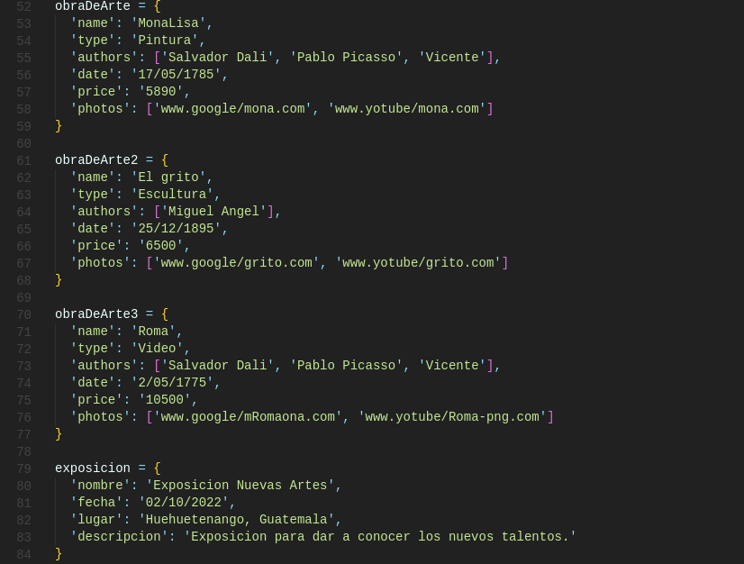

  5. La ejecucion seria la siguiente:

  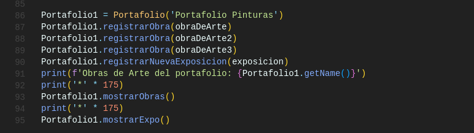

  6. La salida es la siguiente:

  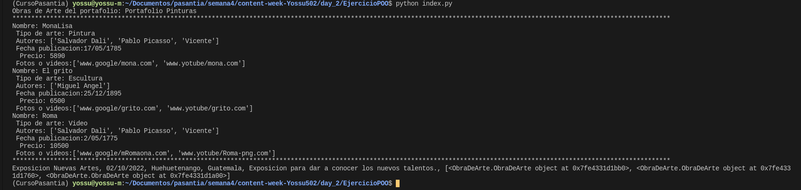